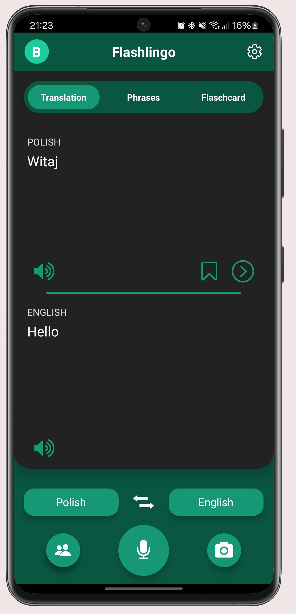
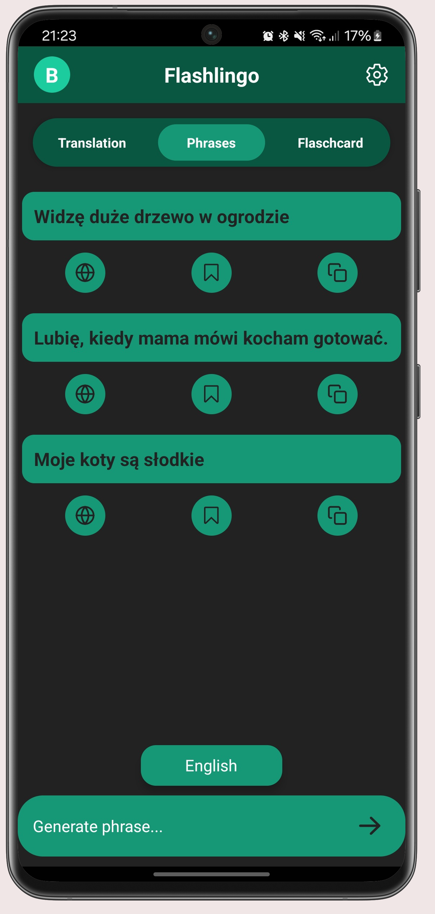
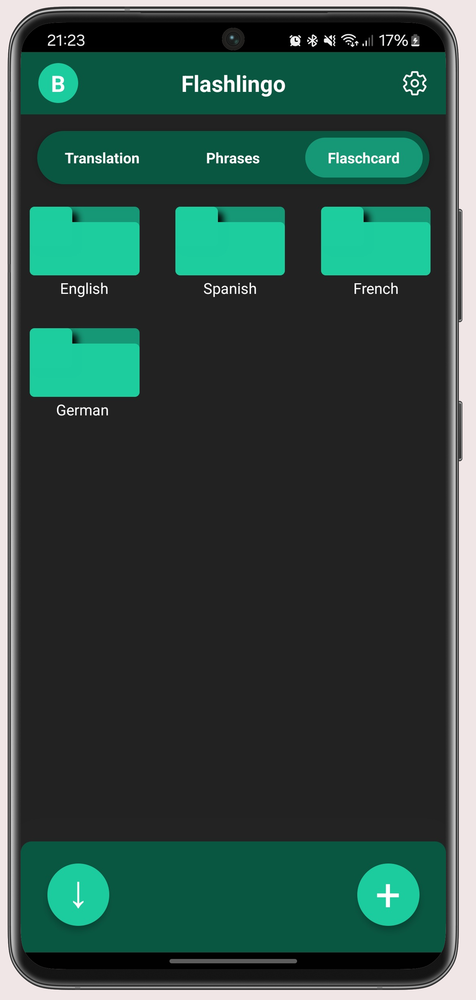

# Flashlingo - Language Learning Made Interactive

<p align="center">
  
</p>

Flashlingo is a comprehensive language learning application that helps users translate text, practice vocabulary with flashcards, and improve language skills through interactive features. Built with React Native and Expo for the frontend and Spring Boot for the backend, Flashlingo provides a seamless experience across mobile and web platforms.

## 🌟 Features

### Translation

<p align="center">
  
</p>

- **Real-time text translation** between multiple languages
- **Voice input and output** for practicing pronunciation
- **Auto language detection** for convenient translations
- **Translation history** to track your learning progress
- **Text-to-speech** functionality for pronunciation practice

### Phrases

<p align="center">
  
</p>

- **AI-powered sentence generation** from keywords
- **Instant translation** of generated sentences
- **One-click copy** to clipboard functionality
- **Quick save** as flashcards for later practice
- **Customizable context** for sentence generation

### Flashcards

<p align="center">
  
</p>

- **Create custom flashcard folders** to organize vocabulary by topic
- **Import and export flashcards** to share with other learners
- **Practice mode** to review and test your knowledge
- **Progress tracking** with correct/incorrect response statistics

## 🚀 Technology Stack

### Frontend

- **Framework**: React Native with Expo
- **Navigation**: Expo Router
- **API Integration**: Axios for REST API communication
- **Authentication**: JWT token-based auth
- **Internationalization**: i18next for localization
- **Testing**: Cypress for E2E testing
- **UI Components**: Custom components with React Native

### Backend

- **Framework**: Spring Boot
- **Database**: PostgreSQL
- **Authentication**: Spring Security with JWT
- **API Documentation**: Swagger/OpenAPI
- **Testing**: JUnit, Mockito
- **Translation Services**: Integration with external translation APIs
- **Text-to-Speech**: Integration with speech synthesis services

## 🔧 Development Setup

### Frontend Setup

1. Install Expo CLI globally (if not already installed):

```bash
npm install -g expo-cli
```

2. Navigate to the frontend directory:

```bash
cd frontend
```

3. Install dependencies:

```bash
npm install
```

4. Configure environment variables:
   Copy `.env.example` to `.env` and fill in the required values:

```bash
cp .env.example .env
```

5. Start the development server:

```bash
npx expo start
```

You can then:

- Press `w` to open in web browser
- Press `a` to open in Android emulator
- Press `i` to open in iOS simulator
- Scan the QR code with Expo Go app on your mobile device

### Backend Setup

1. Navigate to the backend directory:

```bash
cd backend
```

2. Configure environment variables:
   Copy `.env.example` to `.env` and fill in the required values:

```bash
cp .env.example .env
```

3. Start the backend server:

```bash
./mvnw spring-boot:run
```

4. **Set up AWS account and configure CLI**  
   The application uses AWS services for features such as OCR, translation, speech synthesis, transcription, and text analysis.  
   You need to have an AWS account with **full access** to the following services:

   - **Amazon Textract** – for extracting text from documents
   - **Amazon Translate** – for translating text
   - **Amazon Polly** – for text-to-speech conversion
   - **Amazon Transcribe** – for speech-to-text conversion
   - **Amazon Comprehend** – for natural language processing

   **Steps:**

   - Create an AWS account at [https://aws.amazon.com](https://aws.amazon.com)
   - Install the AWS CLI: [Installation guide](https://docs.aws.amazon.com/cli/latest/userguide/getting-started-install.html)
   - Configure the CLI with your credentials:

     ```bash
     aws configure
     ```

   > ⚠️ Make sure your AWS IAM user has **full access** to:
   >
   > - `Comprehend`
   > - `Polly`
   > - `Textract`
   > - `Transcribe`
   > - `Translate`

### Important Notes

- The backend requires PostgreSQL to be installed and running
- For OAuth2 to be working you need to setup a GOOGLE_CLIENT_WEB_ID and GOOGLE_CLIENT_ANDROID_ID
- For phrase generation to be working you need to set up an OPEN_API_KEY
- For email verification to work, you need to set up an app-specific password for your mail
- For OCR, translation, speech synthesis, transcription, and text analysis you need to set up AWS CLI.

## 🌐 API Integration

The application uses a RESTful API architecture with the following main endpoints:

- `/api/auth/*` - Authentication endpoints
- `/api/translation/*` - Translation services
- `/api/flashcard/*` - Flashcard management
- `/api/phrases/*` - Phrases management

## 👥 Contributors

- **Kacper Stasiak** - [GitHub](https://github.com/stejzy)
- **Jakub Cendalski** - [GitHub](https://github.com/Ceendi)
- **Kacper Witek** - [GitHub](https://github.com/KacperWitek)
- **Kacper Przybylski** - [GitHub](https://github.com/KacperFTIMS/)

## 📄 License

This project is licensed under the MIT License - see the [LICENSE](LICENSE) file for details.

---

_Flashlingo - Connecting people through language learning_
